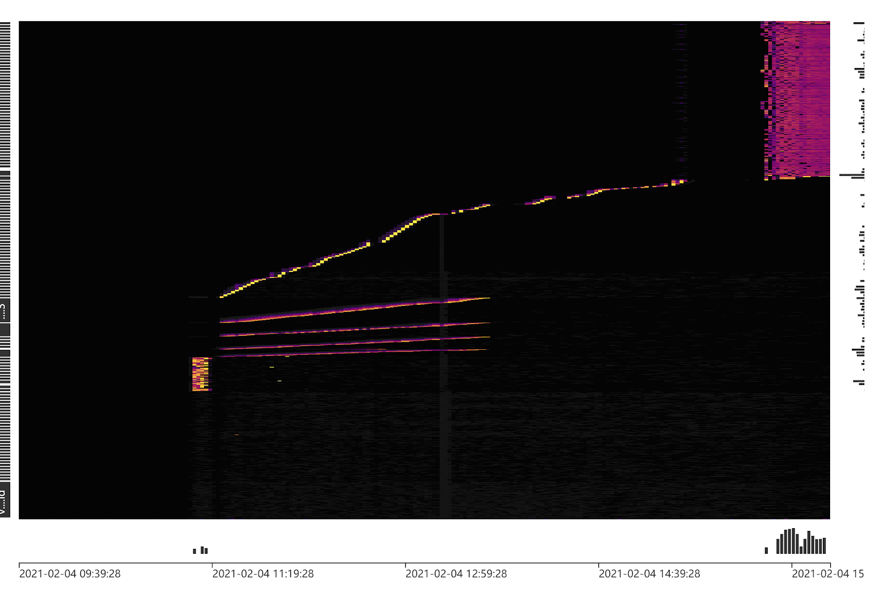

# 缓解热点问题

## 1. 写入热点

大部分单机 RDBMS 采用 B+ tree 数据结构，主键往往是用于组织数据的关键索引（此时表被称作索引组织表），同一数据页内的记录按主键顺序存放。因此单机 RDBMS 产品一般推荐写入连续的序列号，这样每次写入新的记录，都会顺序添加到当前 B+ tree 索引节点的后续位置，当前的数据页写满时，会自动开始新一页的写入。相反，过于随机的主键值，会导致新记录被写入到数据页的某个中间位置，造成数据的移动而带来了额外的开销。

虽然 TiDB 具有不同于单机 RDBMS 的数据结构，但顺序的主键值写入，在 TiDB 上也会产生类似的效果：TiKV 上一个的 Region 被写满，进而分裂出一个新的 Region ，后续的写入转由新的 Reigon 来承载。但甲之蜜糖，乙之砒霜，单机 RDBMS 的最佳实践放到 TiDB 上，会使写入压力总是集中在一个 Region 上，这样就构成了持续的写入热点，无法发挥出 TiDB 这种分布式数据库的并行写入能力，降低了业务写入瓶颈，造成了系统资源的浪费。

TiDB 发生写入热点的原因主要有以下几种：

- 小表，整个表只有一个 Region ，高并发的请求会造成读写热点。

- 大量写入时 Key 值的离散程度不足以跳过一个 Region  大小（96 MB）而引起写入热点。

## 2. 热点的观测和定位

从 TiDB v4.0 版本开始提供便于迅速识别集群负载的 Dashboard 流量可视化页面（Key Visualizer），下图展示了写入热点的显示效果，中间一条明亮的曲线即标志着存在一张连续写入 Key 值的表。而右上侧的一组线条则显示出一个写入压力较为均匀的负载。Key Visualizer 的具体使用方法请参考[官方文档](https://docs.pingcap.com/zh/tidb/stable/dashboard-key-visualizer)。

图 1. 写入热点在 Dashboard Key Visualizer 中的显示效果

## 3. 写入热点的缓解

1. 配置 `SHARD_ROW_ID_BITS` 参数打散写入热点

    对于非索引组织表（默认行为），TiDB 会使用一个隐式的自增 rowid，大量 INSERT 时会把数据集中写入单个 Region，造成写入热点。 通过设置 `SHARD_ROW_ID_BITS` 可以把 rowid 打散写入多个不同的 Region，缓解写入热点问题。 但是设置的过大会造成 RPC 请求数放大，增加 CPU 和网络开销。
    
    用 `SHARD_ROW_ID_BITS` 来设置隐藏列 \_tidb_rowid 分片数量的 bit 位数，默认值为 0，即 2\^0 = 1 个分片。SHARD_ROW_ID_BITS = 4 代表 16 个分片， `SHARD_ROW_ID_BITS = 6` 表示 64 个分片， `SHARD_ROW_ID_BITS = 0` 就是默认值 1 个分片 。
    
    CREATE TABLE 语句示例：`CREATE TABLE t (c int) SHARD_ROW_ID_BITS = 4 PRE_SPLIT_REGIONS=4;`
    
    ALTER TABLE 语句示例：`ALTER TABLE t SHARD_ROW_ID_BITS = 4 PRE_SPLIT_REGIONS=4;`
2. 避免连续自增的主键设计

    对索引组织表来说，它无法利用到 `SHARD_ROW_ID_BITS` 的优化，可以通过修改序列号的生成方式来构成多个写入分片来分散写入热点。
    
    AUTO_INCREMENT 主键可通过 AUTO_RANDOM 机制来打散写入热点，详见[官网文档](https://docs.pingcap.com/zh/tidb/v4.0/troubleshoot-hot-spot-issues#使用-auto_random-处理自增主键热点表)。
    
    例如以下示例 为 Snowflake 生成的序列号。经过转换，将最后一位数字移动到左数第二个数字的位置，原左数第二位数字及之后的所有数字向右移动一位。以此来让生成的 ID 跨越 96 MB 的 Region 容量，落在 10 个不同的分片中。左侧为原本要写入表中的序列号值，右侧为转换后的序列号。经过转换后的序列号不再连续且离散程度足以跳过一个 Region 大小，以此方式来分散写入热点：
    
    | 原始序列号             | 转换后的序列号         |
    | ---------------------- | ---------------------- |
    | 56163237172451737**6** | 5**6**6163237172451737 |
    | 56163237172871168**0** | 5**0**6163237172871168 |
    | 56163237172871168**1** | 5**1**6163237172871168 |
    | 56163237172871168**2** | 5**2**6163237172871168 |
    | 56163237173290598**4** | 5**4**6163237173290598 |
    | 56163237173290598**5** | 5**5**6163237173290598 |
    | 56163237173290598**6** | 5**6**6163237173290598 |
    | 56163237173290598**7** | 5**7**6163237173290598 |
    | 56163237173290598**8** | 5**8**6163237173290598 |
    | 56163237173710028**8** | 5**8**6163237173710028 |
    
    表 1. 将连续的写入转换为 10 个分片写入的案例

3. 分区表

    [分区表](https://docs.pingcap.com/zh/tidb/stable/partitioned-table#%E5%88%86%E5%8C%BA%E8%A1%A8)（[partitioned table](https://docs.pingcap.com/tidb/stable/partitioned-table)）可以将一张表的数据分散到多张物理表中，而多张物理表的数据是分散在多个 region 中的，因此通过合理的设计分区规则，可以进一步避免写入热点问题。

## 4. 读取热点

即使使用了上述的 `SHARD_ROW_ID_BITS` 方式打散数据在 Region 上的分布，有些小表的热点问题也可能依然存在。典型场景是被频繁读取的参数配置表，高并发的读取集中在一个或几个 Region 上，有可能成为整笔交易的性能瓶颈。

如果表的数据量比较小，数据存储大概率只涉及到一个 Region ，大量请求对该表进行写入或者读取都会造成该 Region 热点，可以通过拆分 Region 的方式进行调整：

手工拆分 ：`operator add split-region 1 // 将 region 1 对半拆分成两个 Region`

自动拆分：在 4.0 版本中引入了 Load Base Split 功能，可以实现热点小表的自动 Split。Load Base Split 会基于统计信息自动拆分 Region。通过统计去识别出那些读流量在10s 内持续超过阈值的 Region，并在合适的位置将这些 Region 拆分。在选择拆分的位置时，会尽可能平衡拆分后两个 Region 的访问量，并尽量避免跨 Region 的访问。在 4.0 版本上已经默认开启该功能。

如果表的数据量比较大，leader 分布不均衡，某些 tikv 节点 Region leader 比较多，不均衡导致的热点需要通过某种机制平衡 leader 分布，平衡方式参考如下：

自动均衡: `curl -G "host:status_port/tables/{db}/{table}/scatter" // 打散相邻 region`

手动均衡: `operator add transfer-leader 1 2 // 把 region 1 的 leader 调度到 store 2`

也可以使用 TiDB 的 Coprocessor Cache 功能，以在TiDB 实例侧缓存下推给 TiKV 计算的结果，以减少对小表的访问。

推荐做法是在应用侧做缓存处理，使用如 Redis 这样的产品进行缓存。
